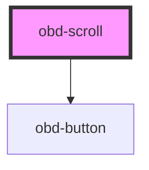

# obd-scroll

<!-- Auto Generated Below -->

## Properties

| Property   | Attribute   | Description | Type     | Default |
| ---------- | ----------- | ----------- | -------- | ------- |
| `scrollTo` | `scroll-to` |             | `string` | `''`    |

## Dependencies

### Depends on

- [obd-button](../button)

### Graph

----------------------------------------------

*Built with [StencilJS](https://stenciljs.com/)*
