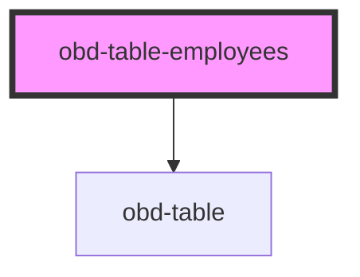

# obd-table-employee

<!-- Auto Generated Below -->

## Properties

| Property    | Attribute   | Description | Type     | Default |
| ----------- | ----------- | ----------- | -------- | ------- |
| `employees` | `employees` |             | `string` | `'[]'`  |

## Events

| Event    | Description | Type               |
| -------- | ----------- | ------------------ |
| `delete` |             | `CustomEvent<any>` |
| `edit`   |             | `CustomEvent<any>` |

## Dependencies

### Depends on

- [obd-table](../table)

### Graph

----------------------------------------------

*Built with [StencilJS](https://stenciljs.com/)*
