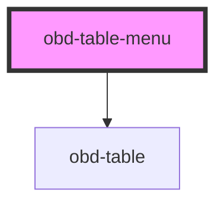

# obd-table-menu

<!-- Auto Generated Below -->

## Properties

| Property  | Attribute | Description | Type     | Default                                                   |
| --------- | --------- | ----------- | -------- | --------------------------------------------------------- |
| `meals`   | `meals`   |             | `string` | `'[{"id":35,"meal":"test","price":"12.00","menu_id":4}]'` |
| `message` | `message` |             | `string` | `'Táto stránka neexistuje.'`                              |

## Events

| Event    | Description | Type               |
| -------- | ----------- | ------------------ |
| `delete` |             | `CustomEvent<any>` |
| `edit`   |             | `CustomEvent<any>` |

## Dependencies

### Depends on

- [obd-table](../table)

### Graph

----------------------------------------------

*Built with [StencilJS](https://stenciljs.com/)*
