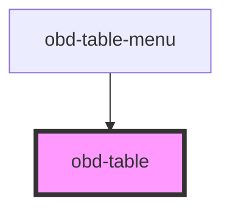

# obd-table

<!-- Auto Generated Below -->

## Properties

| Property  | Attribute | Description | Type     | Default     |
| --------- | --------- | ----------- | -------- | ----------- |
| `actions` | `actions` |             | `string` | `'[]'`      |
| `columns` | `columns` |             | `string` | `'[]'`      |
| `data`    | `data`    |             | `string` | `'{}'`      |
| `layout`  | `layout`  |             | `string` | `'inherit'` |

## Events

| Event    | Description | Type               |
| -------- | ----------- | ------------------ |
| `action` |             | `CustomEvent<any>` |

## Dependencies

### Used by

 - [obd-table-menu](../table-menu)

### Graph

----------------------------------------------

*Built with [StencilJS](https://stenciljs.com/)*
